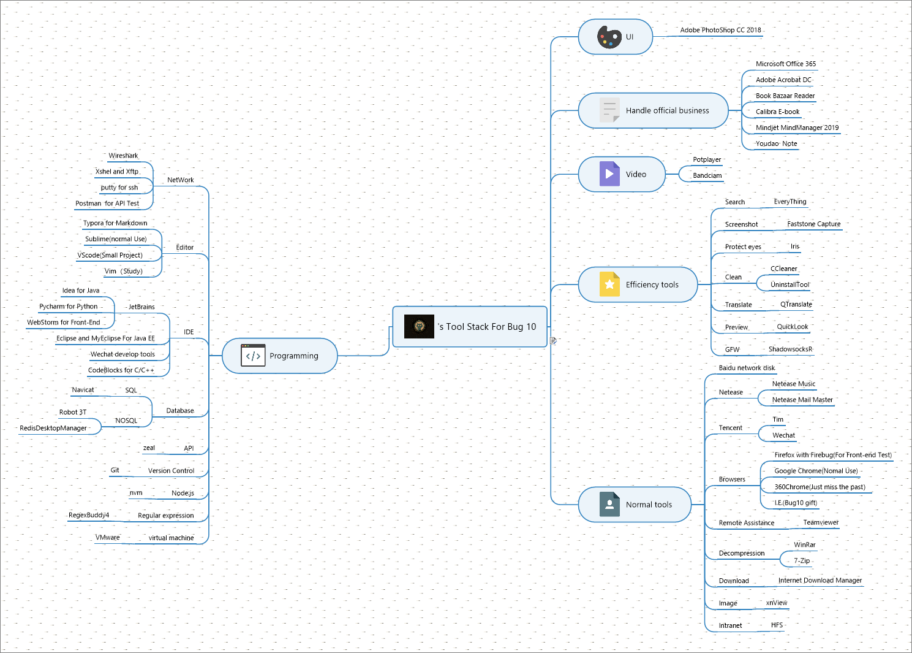

# ataolaSkillsStack
阿涛啦的成长技术栈（学习笔记开源部分）持续更新中 :rocket: :rocket: :rocket:
微信公众号：搜 ==> ataola | 阿涛啦 都可以, 欢迎您的到来， 谢谢！

#### 1、文件规范

>这里是阿涛啦童鞋整理的前端的一些文件规范以及常用配置

###### &nbsp;&nbsp;1.1、[CSS](./FileSpecification/css/README.md)

&nbsp;&nbsp; &nbsp;&nbsp;*关于CSS文件规范，主要有CSS文件的模板注释，对reset.css和normalize.css做了介绍并总结*

###### &nbsp;&nbsp;1.2、JS

&nbsp;&nbsp; &nbsp;&nbsp;*关于JS文件规范，主要有JS文件的模板注释，具体的参见[template.js](./FileSpecification/js/template.js)*

###### &nbsp;&nbsp;1.3、[HTML](./FileSpecification/html/README.md)
 
&nbsp;&nbsp; &nbsp;&nbsp;*关于HTML文件规范，主要有HTML文件的模板注释,以及对其历史做简要介绍*

###### &nbsp;&nbsp;1.4、[代码检查](./FileSpecification/code/README.md)
 
&nbsp;&nbsp; &nbsp;&nbsp;*基于npm的代码检查工作流*

###### &nbsp;&nbsp;1.5、[SQL脚本](./ToolsUseage/Mysql/template.sql)

&nbsp;&nbsp; &nbsp;&nbsp;*SQL规范脚本*

###### &nbsp;&nbsp;1.6、[JSON接口规范](./ToolsUseage/JSON/template.json)

&nbsp;&nbsp; &nbsp;&nbsp;*给个模板，照着造轮子，大致是这样的，剩下的同志们自行脑补，这里举成功的例子，失败的请反推，JSON的话就是注释这块不是很友好，其他都挺好*

#### 2、工具使用

>这里是阿涛啦童鞋整理的工具使用配置和规范

###### &nbsp;&nbsp;2.1、[VSCode](./ToolsUseage/VSCode/README.md)
&nbsp;&nbsp; &nbsp;&nbsp;*关于工具VSCode的介绍，包含了C以及C++环境的配置、Python环境的配置、文件模板的配置、用户信息的配置等*

###### &nbsp;&nbsp;2.2、[涛版颜色表（UI）](./ToolsUseage/ColorTable/README.md)
&nbsp;&nbsp; &nbsp;&nbsp;*关于工作中视觉交互颜色的整理总结*

###### &nbsp;&nbsp;2.3、[MySQL](./ToolsUseage/Mysql/README.md)
&nbsp;&nbsp; &nbsp;&nbsp;*关于Mysql的一些问题*

###### &nbsp;&nbsp;2.4、[Jmeter](./ToolsUseage/Jmeter/README.md)
&nbsp;&nbsp; &nbsp;&nbsp;*做测试用的 点点点工具*

###### &nbsp;&nbsp;2.5、[Excel](./ToolsUseage/Excel/README.md)
&nbsp;&nbsp; &nbsp;&nbsp;*以具体的示例来重学Excel，这样记得会深刻一点，愿景是在有一定编码能力的基础上，提高图表数据处理能力。如果学有余力会搞VBA，也是蛮牛逼的*

###### &nbsp;&nbsp;2.6、[npm script](./ToolsUseage/npm/README.md)
&nbsp;&nbsp; &nbsp;&nbsp;*npm script的学习*

###### &nbsp;&nbsp;2.7、[webpack](./ToolsUseage/webpack/README.md)
&nbsp;&nbsp; &nbsp;&nbsp;*webpack的学习*

###### &nbsp;&nbsp;2.8、[Git+Gitlab+Jenkins+ansible](./ToolsUseage/git/README.md)

&nbsp;&nbsp; &nbsp;&nbsp;*Git的学习*

###### &nbsp;&nbsp;2.9、[计算机硬件](./ToolsUseage/computer/README.md)

&nbsp;&nbsp; &nbsp;&nbsp;*计算机的一些组装配置学习*

###### &nbsp;&nbsp;2.10、[Jetbrain](./ToolsUseage/jetbrain/README.md)

&nbsp;&nbsp; &nbsp;&nbsp;*Jetbrains学习*

###### &nbsp;&nbsp;2.11、[构建工具](./ToolsUseage/buildTools/README.md)

&nbsp;&nbsp; &nbsp;&nbsp;*构建工具学习*

###### &nbsp;&nbsp;2.12、[Vim](./ToolsUseage/vim/README.md)

&nbsp;&nbsp; &nbsp;&nbsp;*vim学习*

###### &nbsp;&nbsp;2.13、[windows](./ToolsUseage/windows/README.md)

&nbsp;&nbsp; &nbsp;&nbsp;*windows学习*

我大学整理的window下一些用起来很舒服的软件，具体看楼下这图：

#### 3、环境搭建

>这里是阿涛啦童鞋整理的环境搭建笔记

###### &nbsp;&nbsp;3.1、[hexo + github](./EnvSet/hexo/README.md)

&nbsp;&nbsp; &nbsp;&nbsp;*基于hexo和github搭建免费的静态页面个人博客*

###### &nbsp;&nbsp;3.2、[nginx](./EnvSet/nginx/README.md)

&nbsp;&nbsp; &nbsp;&nbsp;*nginx的编译安装配置*

###### &nbsp;&nbsp;3.3、[测试环境之Jest](./EnvSet/jest/README.md)

&nbsp;&nbsp; &nbsp;&nbsp;*基于jest的测试环境脚手架*

###### &nbsp;&nbsp;3.4、[Docker](./EnvSet/docker/README.md)

&nbsp;&nbsp; &nbsp;&nbsp;*Docker的学习*

###### &nbsp;&nbsp;3.5、[JDK](./EnvSet/Jdk/README.md)

&nbsp;&nbsp; &nbsp;&nbsp;*JDK的学习*

###### &nbsp;&nbsp;3.6、[centos](./EnvSet/centos/README.md)

&nbsp;&nbsp; &nbsp;&nbsp;*centos的学习*

###### &nbsp;&nbsp;3.7、[Node.JS](./EnvSet/Node.JS/README.md)

&nbsp;&nbsp; &nbsp;&nbsp;*Node.JS的学习*

###### &nbsp;&nbsp;3.8、[Python](./EnvSet/Python/README.md)

&nbsp;&nbsp; &nbsp;&nbsp;*Python的学习*

###### &nbsp;&nbsp;3.9、[.Net](./EnvSet/dotNet/README.md)

&nbsp;&nbsp; &nbsp;&nbsp;*.Net的学习*

#### 4、网站整理

>这里是阿涛啦童鞋整理的网站，当然有些的话一星保护，私人用就不放了。

###### &nbsp;&nbsp;4.1、前端

&nbsp;&nbsp; &nbsp;&nbsp;*前端部分相关学习网站*

&nbsp;&nbsp; &nbsp;&nbsp;[CSS](./Website/FrontEnd/CSS.md)

&nbsp;&nbsp; &nbsp;&nbsp;[框架](./Website/FrontEnd/frame.md)

###### &nbsp;&nbsp;4.2、后端

&nbsp;&nbsp; &nbsp;&nbsp;*后端部分相关学习网站*

&nbsp;&nbsp; &nbsp;&nbsp;**[Node.JS](./Website/BackEnd/nodejs.md)**

###### &nbsp;&nbsp;4.3、数据库

&nbsp;&nbsp; &nbsp;&nbsp;*数据库部分相关学习网站*

&nbsp;&nbsp; &nbsp;&nbsp;**[Redis](./database/redis/README.md)**

&nbsp;&nbsp; &nbsp;&nbsp;**[Mysql](./database/mysql/README.md)**

###### &nbsp;&nbsp;4.4、运维

&nbsp;&nbsp; &nbsp;&nbsp;*运维部分相关学习网站*

&nbsp;&nbsp; &nbsp;&nbsp;[相关镜像站仓库](./Website/Operation/Repository.md)

###### &nbsp;&nbsp;4.5、综合部分

&nbsp;&nbsp; &nbsp;&nbsp;*综合部分相关学习网站*

&nbsp;&nbsp; &nbsp;&nbsp;[书籍文档](./Website/Comprehensive/books.md)

&nbsp;&nbsp; &nbsp;&nbsp;[翻译](./Website/Comprehensive/translate.md)

&nbsp;&nbsp; &nbsp;&nbsp;[博客论坛](./Website/Comprehensive/blogs.md)

&nbsp;&nbsp; &nbsp;&nbsp;[便捷工具箱](./Website/Comprehensive/tools.md)

&nbsp;&nbsp; &nbsp;&nbsp;[看世界](./Website/Comprehensive/seeWorld.md)

###### &nbsp;&nbsp;4.6、测试

&nbsp;&nbsp; &nbsp;&nbsp;*测试相关学习网站*

&nbsp;&nbsp; &nbsp;&nbsp;**[测试相关学习站点](./Test/README.md)**

#### 5、代码家

>工作中用到或者看到的代码片段，下次看到要是忘了就看下自己的仓库巩固下，要是熟悉的话直接贴，把时间留给快乐不是蛮好的吗？

###### &nbsp;&nbsp;5.1、[基础知识](./code/jc/README.md)

###### &nbsp;&nbsp;5.2、[前端](./code/fe/README.md)

&nbsp;&nbsp; &nbsp;&nbsp;*前端部分的一些酷毙了的代码*

###### &nbsp;&nbsp;5.3、[算法](./code/algorithm/README.md)

###### &nbsp;&nbsp;5.4、~~[职来职往](./code/zlzw/README.md)~~

#### 6、思考总结

>对于一些问题的思考总结

[一些日常思考](note/log.md)

#### 7、前端三驾马车

>如今这个时代，上古程序员早已为你铺好道路，学框架省时省力效率高，当然知道其原理和底层实现还是很重要的，因为面试官老问啊，你找工作要用，但更重要的还是一种思维的学习，方法的沉淀。

###### &nbsp;&nbsp; [Vue](./frame/vue/README.md)

#### 8、移动端

>在已有页面设计的基础上，真机调试是少不了的

[一些日常实践](mobie/log.md)

#### 9、学习成长

>一些非技术相关的学习成长

[一些非技术方面学习成长的日志](neverStopStudy/log.md)

#### 10、后端技术

>后端技术学习笔记

###### &nbsp;&nbsp; [Node.JS](./backEnd/nodejs/README.md)

#### 11、有空一题

>巧了，为了防止老年痴呆，我也开始搞每日一题，但我可能做不到每日，如果下一年能够比上一年有些进步，那便是蛮开心的事

###### &nbsp;&nbsp; [江涛的题库](./tiku/README.md)

###### &nbsp;&nbsp; [ataola刷题链](./tiku/log.md) 备注：楼上的迁移到楼下这里

#### 12、计算机网络

###### &nbsp;&nbsp; [Wireshark抓包](./network/wireshark/README.md)

## 知识共享许可协议

  

本作品采用 [知识共享署名-非商业性使用-相同方式共享 4.0 国际许可协议](http://creativecommons.org/licenses/by-nc-sa/4.0/) 进行许可。
