## 涛版颜色表

> 工作中碰到的以及学习时发现的，吐血整理，对颜色的命名仅供参考，阿涛啦词汇量有限

#### 大众系

天然红 

天然绿 

天然蓝 

天然黄 

天然黑 

深沉黑 

炭黑色 

天然白 

段落灰 

透明色 

淡灰色 

中灰色 

天然灰 

亮灰色 

薄荷糖 

#### 原谅色系

养眼绿 

荧光绿 

深沉绿 

灰加绿 

草母绿 

海洋绿 

淡淡绿 

翡翠绿 

青春绿 

#### 暖色系

砖头红 

淡玉绿 

书本黄 

少女粉 

土橙色 

朴素红 

暖黄色 

亮红色 

樱花红 

橙黄色 

艳红色 

#### 冷色系

深沉蓝 

淡海蓝 

科技蓝 

淡淡蓝 

蓝灰色 

蓝绿色 

绿蓝色 

优雅蓝 

天空蓝 

#### 简约七色

> 由白到灰  用于背景边框

一楼 
二楼 
三楼 
四楼 
五楼 
六楼 
七楼 

#### 春花泛滥

>由早春到暮春，23333……

一楼 
二楼 
三楼 
四楼 
五楼 
六楼 
七楼 

#### CSS原生支持的颜色

> 这些只要打字母，不用写16进制或者RGB

black 

silver 

gray 

white 

margoon 

red 

purple 

fuchsia 

green 

lime 

olive 

yellow 

navy 

blue 

teal 

aqua 

orange 

#### 慕课色

慕课黑 

慕课白 

慕课橙 

慕课绿 

慕课红 

慕课灰 

慕课淡 

#### 百度

百度蓝 

百度红 

百度灰 

#### 阿里

阿里橙 

阿里棕 

阿里蓝 

阿里深 

阿里黄 

阿里白 

阿里石 

#### 小米

小米黑 

小米橙 

小米灰 

小米浅 

小米绿 

小米红 

小米粉 

小米棕 

小米绿 

#### 豆瓣

豆瓣棕 

豆瓣蓝 

豆瓣橙 

豆瓣蓝 

豆瓣红 

豆瓣绿 

豆瓣黑 

豆瓣翠 

豆瓣草 

豆瓣书 

#### 知乎

知乎蓝 

知乎灰 

知乎淡 

知乎橙 

知乎红 

知乎天 

知乎黄 

知乎樱 

知乎深 

#### 网易

网易黑 

网易灰 

网易白 

网易深 

网易红 

网易蓝 

网易棕 

网易淡 

网易暗 

网易绿 

网易沉 

**wtf??? 在VSCode中预览Markdown是正确的，是自己想要的结果，然后push到本地的gitblit也是友好的显示，没想到备份到github它不支持在markdown文件下使用html的span元素，也罢，上图片吧:expressionless:**

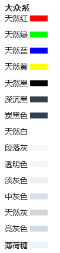

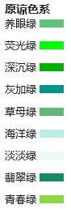

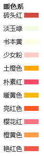

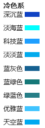

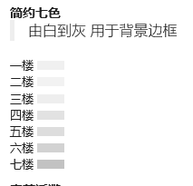

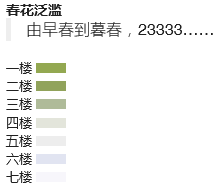

**CSS原生支持色**  

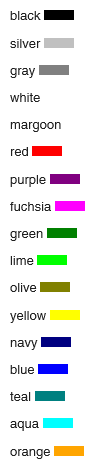

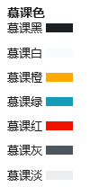

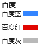

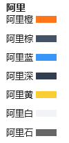

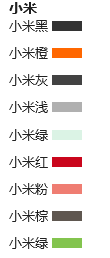

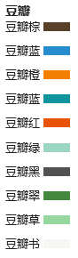

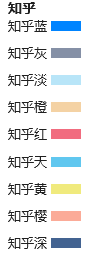

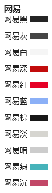

**补充-PPT课件色系**  

牛客：

