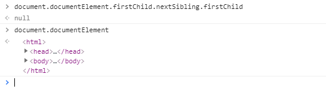

#### 关于Select

* Select去掉那个三角形

* 在Select的option里面添加icon图标(备注：option里面只接收文字，标签啥的都不行哦)

* Select的默认提示只能写在option里面吗？

#### 关于字体

* 像layui、Bootstrap引入的font-awesome的资源文件，如何用页面中用unicode显示

* 在`font-weight:500`的时候看着效果和`font-weight:bold`差不多。

#### 关于a链接

* a链接中的href属性可以放一个链接也可以放一个JavaScript代码或者方法，看到的
不外乎`href="https://www.baidu.com"` ,还有`herf="javascript:call();"`,还有`href="javascript:;"`

#### DOM中有空白，这样子你取值的时候有可能是取不到的

就有几次我在观察一些网站的时候，发现并不是很符合规范的，有些地方会给你空很多，这样子一联想，是不是为了防止被爬虫抓取呢？

## DOM 方法

* getElementById， 在处理远程XML文件，并不是按照ID来的

* getElementsByName， 返回的是一个很数组长得很像的玩意，但是的.push(),.pop(),.shift()等方法

