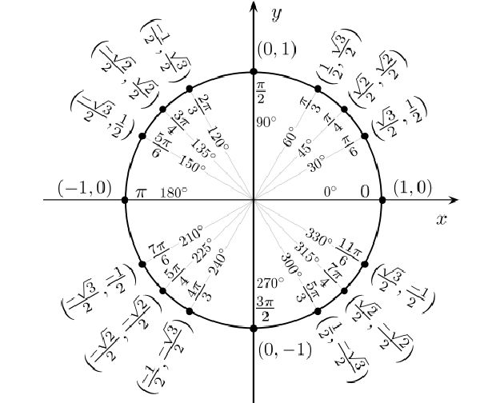

## 基础知识

> 一些基础知识

&nbsp;&nbsp;**三角函数:**
```
#这里先搞特殊角的 例如 
        30   π/6
        45   π/4
        60   π/3
        90   π/2
正弦

余弦

正切

这么一个个写多累啊，这样写吧，如果写错别喷我 ，我数学没学好多年了，早还给老师了。。。。。。

```


[三角函数特殊值代码](../../tiku/repos/ataolaGT_B_0002_sanjiao.js)，反三角函数也类似的，不放了,就是在三角函数前面加个"a"，然后传参是对于的三角函数的结果


&nbsp;&nbsp;**数组遍历的打开姿势:**
```
let testArray = [1, 9, 9, 7, 0, 6, 1, 3]

for(let i = 0; i < testArray.length; i++) {
	console.log(testArray[i])
}

for(let k in testArray) {
	console.log(`${k} : ${testArray[k]}`)
}

console.log(...testArray)

```


