# 职来职往

> 大学时期也做过一些些项目，但是很遗憾，不能很好地展示给面试官，所以这里定性，我的大学没啥作品。后来有了这个意识，一方面是为了自己以后的求职，给求职交一份参考卷，能够让面试官更好地了解我，踏实做事；另一方面也是对自己的知识储备的一个巩固吧。

这里时间只给个区间，主要是记开发吧，像什么维护修bug啥的就不放了，还有一些简单页也不放了，自己玩玩好了。

## 2019.05-2019.06

**项目名称：** 中控智慧课堂

**项目描述：** 中控集团是国内自动化龙头企业，主要的业务是做化工自动化这块，然后我所在的公司呢，是属于它这个综合解决方案中的教育这块，基本上和学校来往比较多，做一些教学仪器，仿真软件等等，为中国教育事业培养人才，所以它这个项目是针对学校的，有点类似与超星尔雅课堂的味道，但没有它们那么成熟，就是一些教学仪器的配套练习，使得传统的考试方式更信息化，少浪费一张纸。

**大致内容：** 参与中控智慧课堂前端界面的设计，由于后台是ASP.NET在做，所以也别期望太高前端三驾马车，基本上就是html3,css3,Javascript(ES5,ES6)在那里猛写，疯狂写页面，像登录注册，列表页，后台管理页，课程页啥的。框架么也用，easy UI, layui这种，没啥创新点亮点,甚至有点咸鱼，这里就不放展示了。

## 2019.07

**项目名称：** 垃圾了么

**项目描述：** 为了响应杭州市政府以及各机关组织的“垃圾分类”的宣传活动，让大家能够更好地了解垃圾分类的知识，树立良好地行为规范，公司领导决定做一个垃圾分类答题的小游戏，于是故事由此展开。

**大致内容：** 

第一步：整体思路规划，这里是使用Mindmanager进行项目整体设计，主要包含三大块内容，前端和后端和数据库。

第二步： 前端技术选型，这里的话，可以知道领导的意思大致是做移动端，这里就有好多梗了，如果自己去写写到猴年马月去啊，那么多个移动端设备，啥曲面屏，刘海屏，折叠屏，还有各个移动端尺寸不一样，为了防止写出烂代码，这里的话先调研，后来的话基本上是有两个选择，一个是阿里的SUI Mobie,这个是一套ios风格的前端移动端组件，遗憾的是据说已经不维护了，作者从阿里辞职，有了新的light7，所以我是选择用lingt7，腾讯的QMUi也不错，就是有点复杂用在我这个项目上，选型好以后就是，建模，我美工不是特别好，这里的话是用墨刀搭建的。如果移动要说有亮点，活动的logo是我设计的，我以前的话有一段时间特别喜欢点外卖，饿了么自然是少不了，后来可能就是家人或者一些朋友劝我少吃点，都是垃圾。所以这就在点子上了，然后每次吃完仍垃圾的时候，我都有这样的疑问，虽然我们是方便了，但是清洁工人就惨了，各种垃圾堆在一起，而且随着天气炎热，还有整整恶臭，所以为了美好的明天，我们还是少点外卖吧，养成垃圾分类的好习惯，这个也是我的初衷。所以这次的logo是一个饿了么加上两只筷子，然后中间一个环保标准做的垃圾桶。我觉得蛮有深意和想象力的，这里提一下我的想法。

第三步： 后端选型，因为受我大三实习时认识的一位大哥主管的影响，我是偏Node的后端，但是公司这边的话，对Node知之甚少，领导这边要求我去学C#写，C#我觉得写windows的客户端比较好，其他的我觉得优势不大。反正我先周末硬刚出一版Node的后台版本，Node的话用来写接口是真的爽，做一个中间件的角色。我这边是用Express框架来搭的服务，两部分吧，一部分是写后台的接口，另外的话就是操作数据库的crud。如果还说要有，那我觉得是一些工具类。

第四步：数据库的设立，这里我用的是power desinger生成的数据库脚本，所以很容易想到我是用关系型数据库Mariadb也就是社区版mysql。具体的模型我就不放了。

最后就是业务逻辑，大致是先登录，这边有点类似活动页，只要求一次的话，那就不需要考虑那么多，先输入用户名和手机号的登录，然后就是进入首页，是一题单选题，选出正确的垃圾桶，然后进入第二关，第二关是将垃圾正确填到指定垃圾桶，第三关是，提交一句环保标语。业务逻辑清楚了，那么代码自然也不会远。

**效果展示：** 这里的话就意思下，后期是会把垃圾桶换成真的模型的,也就是把背景色换成图片，使得更为应景。这里适配了绝大对数屏幕尺寸，真机调试的话，我用的是我自己的手机，其他是模拟器调试的。

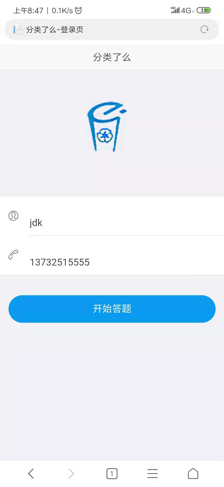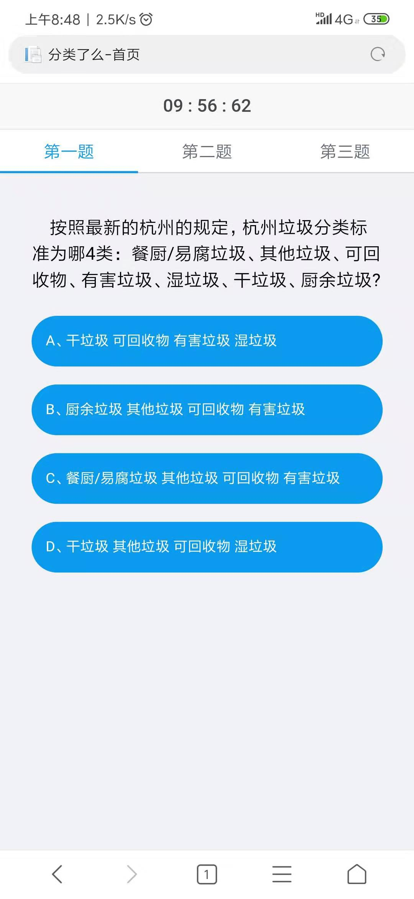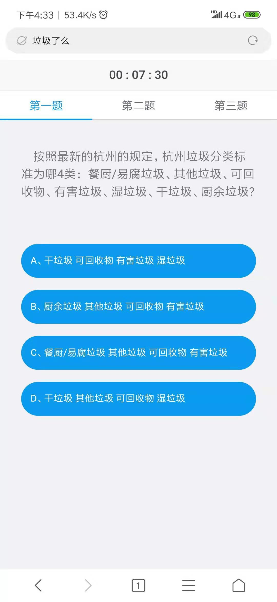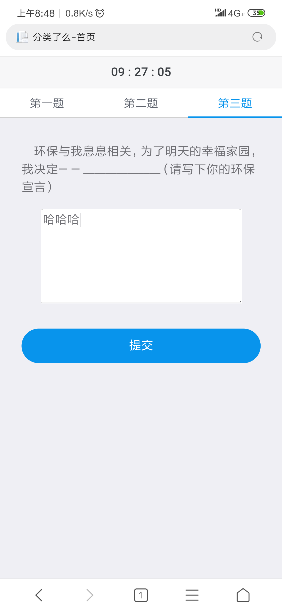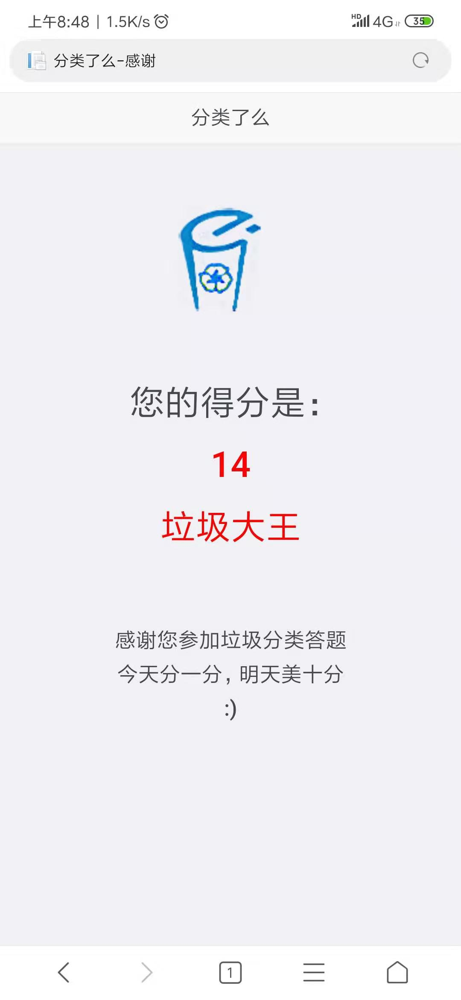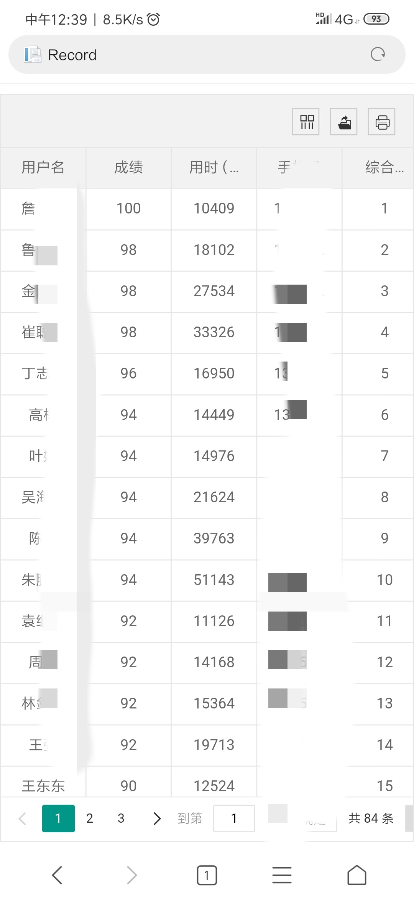

这里简单放一个我以前自己经营的微信公众号吧。(补)
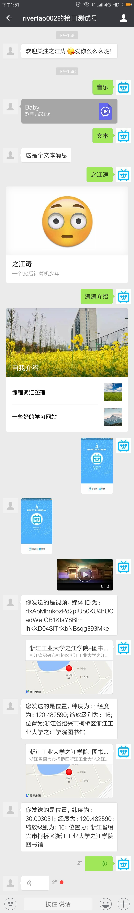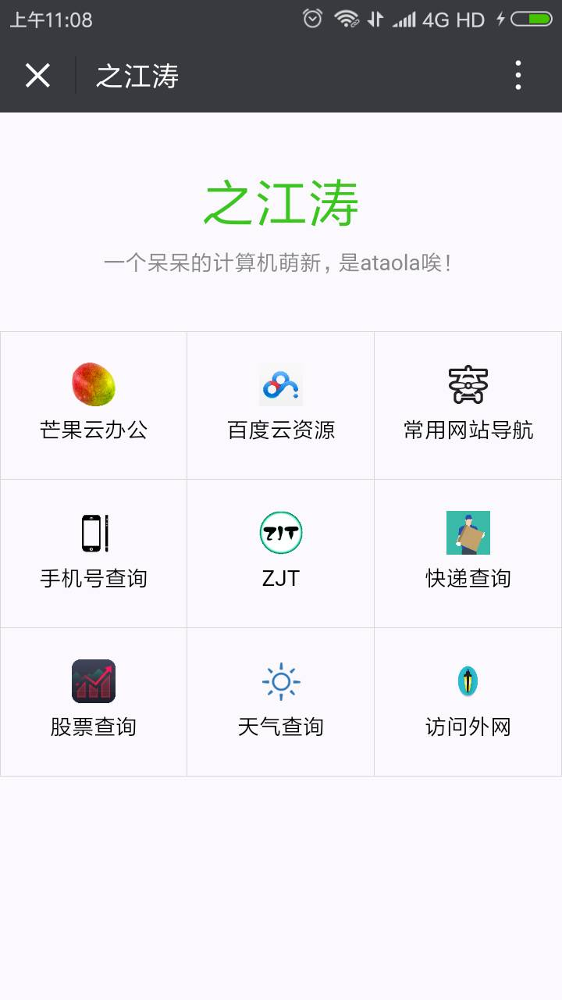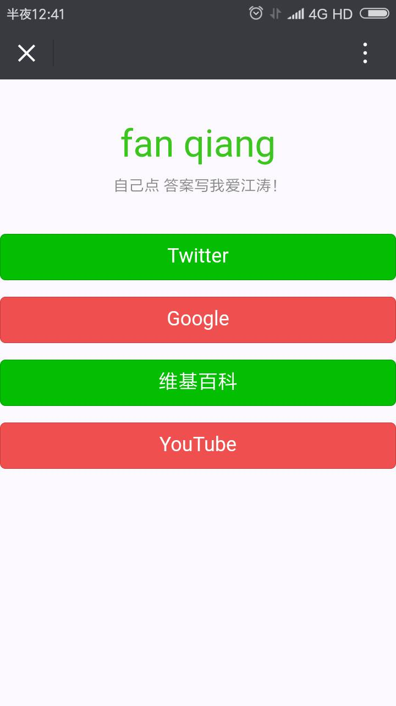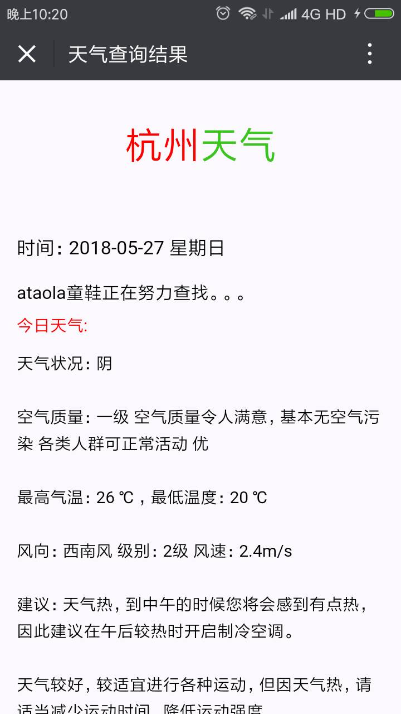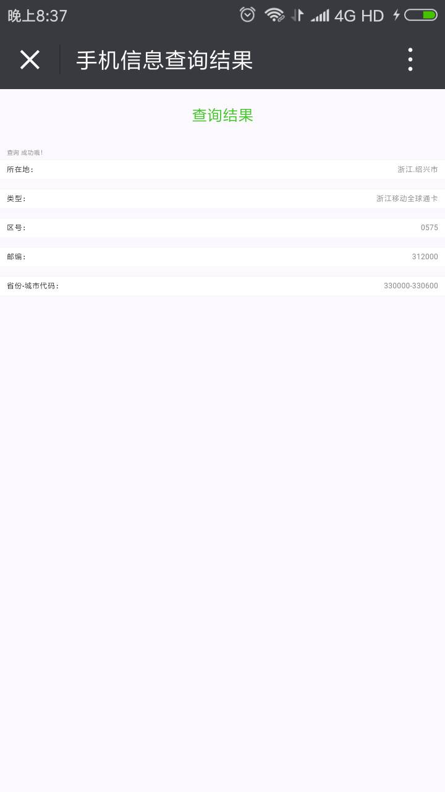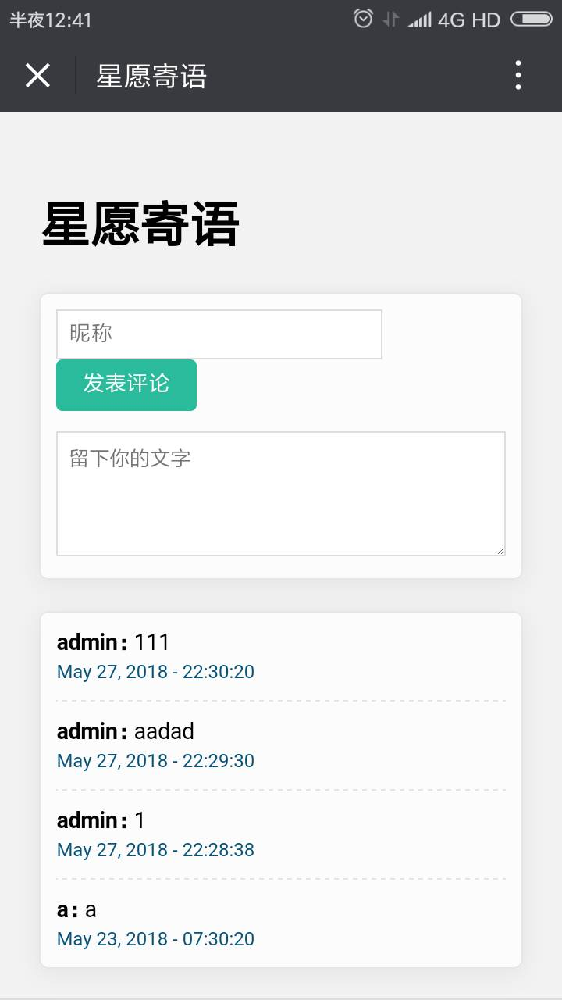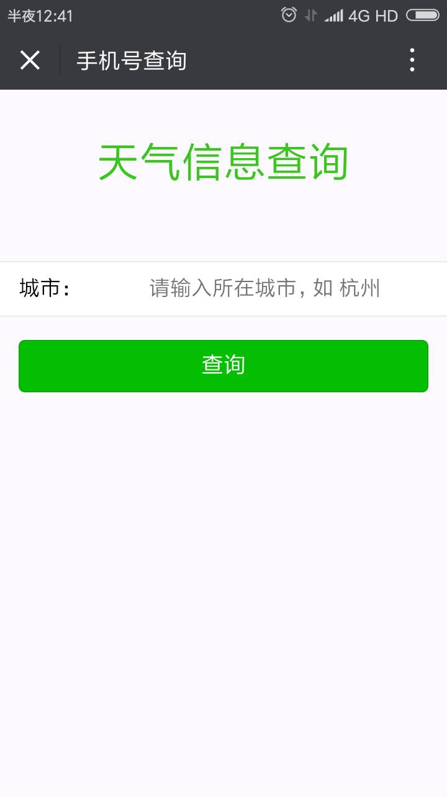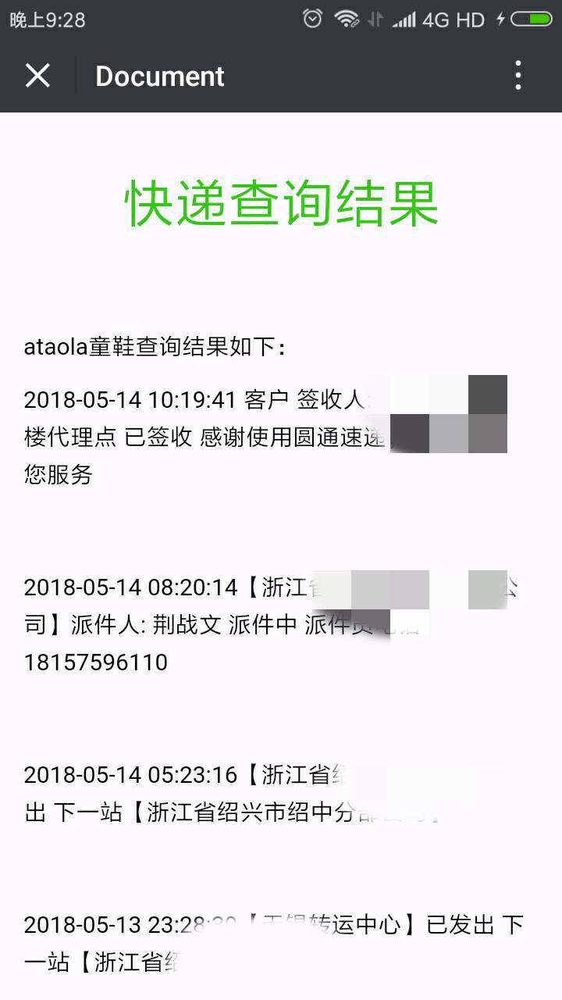
