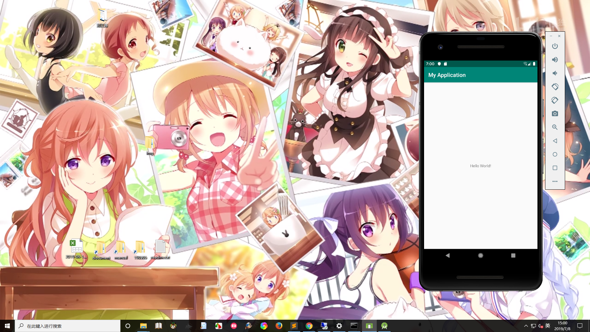

## Android Studio + Flutter断网宇宙终极解决方案

> 首先我说一下结论啊，在我的认知了， 断网是不存在的，别听网上那些什么断网搭建啥的，都是耍流氓，要么就是写一半，要么就是误导少年。谁要是让你断网安装，你就让他滚，滚犊子。今天我想到的方法是骨骼精奇的，特地分享下我的必杀技，哈哈哈。

&nbsp;&nbsp;**断网安装的故事:**
```
#这里的安装方式不清楚可以看我上次的那个讲的东西（Android Studio + Gradle + SDK +Flutter一把梭），这里记录了我蛮多的步骤。我这边就按照我当时的想法复现下这些操作。

    首先说一下，一般吼，软件的安装分为解压版和安装包，像这种断网的情况，我果断选择压缩版，因为我不高兴安装，本来就没网，还巨浪费时间。那么知道这个了我们就开始吧。

    先定义下我的Android开发路径：D:\Android
    Android SDK的安装路径：D:\Android\sdk\android-sdk_r24.1.2-windows(解压版放这里)
    Android Studio的安装路径：D:\Android\android-studio-ide-183.5522156-windows\android-studio（为什么不直接写，要多中间一层呢，嗯，我就想直观的知道它的版本号）
    Flutter的安装路径：D:\Android\flutter_windows_v1.5.4-hotfix.2-stable\flutter（也是解压的）
    Dark的安装路径：D:\Android\dartsdk-windows-x64-release\dart-sdk（这个其实可以不用搞，Flutter联网的话自动会帮你解决的）
    在我们定义好楼上的这些东西以后，我们可以开始搞了。


第一步：Android SDK的安装
    你先下载相应的解压包，把它解压到D:\Android\sdk\android-sdk_r24.1.2-windows这样，然后AVD Manager.exe是创建虚拟机的，SDK Manager.exe是安卓的SDK管理工具，其中期望你知道的是build-tools、platforms、platform-tools、system-images（这个很大的，谨慎下载）、tools（sdkmanager，flutter要用到更新license）这几个文件夹的相关信息。因为我手上是由一个Android6.0的真机和一个Android9.0的真机，所以我事先呢下载了API28和API23这两个，然后最新的我也喜欢下就下了个API29,这里如果你是inter内核的，你只需要下x86的就还了，像amd的我家里那台电脑，连选择的机会都没有，只能搞arm的巨卡无比。
    环境变量的配置：
    ANDROID_HOME： D:\Android\sdk\android-sdk_r24.1.2-windows
    path: %ANDROID_HOME%\platform-tools;%ANDROID_HOME%\build-tools;%ANDROID_HOME%\tools
    到这里，期望你Android SDK没问题了。

第二步：Android Studio的安装
    在没网的环境，我一般都是用解压版，不高兴用安装版。把压缩包解压到相应的位置，D:\Android\android-studio-ide-183.5522156-windows\android-studio，然后进入到bin目录，如果你是32位的你就选择studio.exe，如果你是64位的你就选择studio64.exe。为了便于下次工作，请把相应的exe发送到桌面快捷方式。
    这样子我们的开心版Android Studio就已经安装好了，剩下的看缘分了。
    点击相应的exe进行首次初始化，我们选择custom不要选择standard，这样子我们就可以把Android sdk的路径改成我们事先下好的而不是默认的路径，如果默认路径估计你电脑小后面下API就直接炸了，进去以后，先创建一个hello world项目，后面的事情，让我们把舞台交给gradle

第三步：Gradle的安装
    这个你事先下好相应的压缩包，然后到C:\Users\{your username}\.gradle\wrapper\dists下，把它扔到这里，注意不要解压，然后happy地打开Android Studi，如果不出意外地话，不外乎楼下这几种情况。

   淡淡的悲伤1：ERROR: Unknown host 'dl.google.com'. You may need to adjust the proxy settings in Gradle.
   淡淡的悲伤2：Could not resolve com.android.tools.build:gradle:3.4.1.
   淡淡的悲伤3：No cached version of androidx.appcompat:appcompat:1.0.2 available for offline mode.
   这些都不是你的错，主要是没网。走到这里，后面的我就先让大脑换一换去搞flutter看看

第四步：flutter的安装配置
    将实现下好的开心包解压到指定位置：D:\Android\flutter_windows_v1.5.4-hotfix.2-stable\flutter，然后配置相应的环境变量：
    FLUTTER_STORAGE_BASE_URL：https://storage.flutter-io.cn
    PUB_HOSTED_URL：https://pub.flutter-io.cn
    path:D:\Android\flutter_windows_v1.5.4-hotfix.2-stable\flutter\bin
    最后后flutter doctor运行下是否符合运行环境（加个-v的话会显示详细信息）

    理想的情况是这样的：
    Microsoft Windows [版本 10.0.18362.30]
    (c) 2019 Microsoft Corporation。保留所有权利。

    C:\Users\ataola>flutter doctor -v
    [√] Flutter (Channel stable, v1.5.4-hotfix.2, on Microsoft Windows [Version 10.0.18362.30], locale zh-CN)
        • Flutter version 1.5.4-hotfix.2 at D:\Android\flutter_windows_v1.5.4-hotfix.2-stable\flutter
        • Framework revision 7a4c33425d (2 months ago), 2019-04-29 11:05:24 -0700
        • Engine revision 52c7a1e849
        • Dart version 2.3.0 (build 2.3.0-dev.0.5 a1668566e5)


    [√] Android toolchain - develop for Android devices (Android SDK version 29.0.0)
        • Android SDK at D:\Android\sdk\android-sdk_r24.1.2-windows
        • Android NDK location not configured (optional; useful for native profiling support)
        • Platform android-29, build-tools 29.0.0
        • ANDROID_HOME = D:\Android\sdk\android-sdk_r24.1.2-windows
        • Java binary at: D:\Android\android-studio-ide-183.5522156-windows\android-studio\jre\bin\java
        • Java version OpenJDK Runtime Environment (build 1.8.0_152-release-1343-b01)
        • All Android licenses accepted.

    [√] Android Studio (version 3.4)
        • Android Studio at D:\Android\android-studio-ide-183.5522156-windows\android-studio
        • Flutter plugin version 37.0.1
        • Dart plugin version 183.6156.11
        • Java version OpenJDK Runtime Environment (build 1.8.0_152-release-1343-b01)

    [√] IntelliJ IDEA Ultimate Edition (version 2018.2)
        • IntelliJ at D:\Program Files\JetBrains\IntelliJ IDEA 2018.2.5
        • Flutter plugin version 31.3.3
        • Dart plugin version 182.5124

    [!] Connected device
        ! No devices available

    ! Doctor found issues in 1 category.

    C:\Users\ataola>

    而不理想的情况不外乎：
        1、X Android license status unknown.
        2、 Android Studio | IntelliJ IDEA | VScode 插件没装
    楼下那位还是好解决的，楼上那位网上不管你百度谷歌基本做法类似，不外乎这样子搞：
        flutter doctor --android-licenses，选择 Y
        然后sdkmanager --update
        如果你运气好，可能可以把，运气不好会一直这么个死循环的状态，就是你执行楼上那句，他让你执行下面的，你执行楼下那句显示done，然后你执行楼上的那句，它让你执行楼下的那句，我要奔溃了，于是我果断卸载了我私人电脑上的Android sdk和flutter，啥玩意，谁还没有点脾气，本宝宝不搞了。这个说了也是奇怪，上上个星期放在我那个amd的电脑上，用夜神模拟器 + VSCode + Flutter + Android SDK还是可以的，这个星期由于在公司的电脑上遇到了这些问题所以想回家试试，结果，哎。。。。。。
    
    那个时候，就有点想放弃了，实在是太痛苦了，断网，啥都搞得鸡肋。后来我就想flutter不行，那我原生的总可以吧！结果还是葬送了在gradle上，起先当模拟器打开google的时候，我还是信息满满，略显激动，觉得断网么，无非就是拷拷文件的事情，有啥子问题，谁知道这个坑这么大，反正就是一直试，一直不死心，有两个夜晚，我呆到公司八点过，一个是下在SDK的夜晚，总觉得过一会就好了，比较我开了专用网络，事实上我对其SDK的庞大一无所知，第二个夜晚是gradle编译问题，一直死磕试错，鸡肋啊，最后没达到自己的预期还是有些小失望，自己付出了这么多心血。折腾了好几天，难道就要这样放弃吗？我想了下，能不能这边跑模拟器，然后一台局域网的可以的电脑跑服务，可以肯定是可以的，就是巨麻烦，放弃吧！
    后来我在我自己的公众号上面说我要放弃了flutter，啥子玩意，宁愿重学C++也不搞了，经过了两天的休息。

    周一来到公司上班后，我在想这样一个问题。不能连外网，无非是一些软件的版权问题，然后也有可能是涉及到集团公司的一些核心技术和机密等，毕竟联网既是不安全，反过来想，那我能不能越过集团的网络搞，想了下一楼有一个瑞幸咖啡，难道我要把它搬到一楼吗？我内心是拒绝的。人们都说玩手机不好，玩手机哪里不好了，你怎么不说夜深了，早点睡，对手机不好呢。

    我的解决方案是，用USB数据线去连接台式电脑，然后通过手机的网络建立这个一个桥梁，去和外界通信，然后去放手让gradle和flutter自己去瞎折腾吧，懒得搞的，当你第二次创建项目的时候就不会报错了，因为已经有了缓存，其实想到这个真的很难，这里我真的得夸夸我自己，因为台式机它是不能连接无线的，自然想不到用手机去连接电脑，但是后来被逼的走投无路，也只能这样了，用USB就是一把梭,而这个想法到实现仅仅花了一两个小时。

    这里还是有一件可怕的事情，就是网络安全，一旦你的电脑连上网就别跟我扯安全了，扯的话只能说你对安全一无所知。就是假如我们试想这样一个场景，一个武功极高的特工去机密地执行FBI布置地特种任务，他需要把获取的信息传递给FBI总部，那么拿着他的手机然后插着USB做着看似很SB的事情，是不是很酷，是不是很危险呢？ emmmmmm，手机即网络。

```

最后上一张实验成果：

