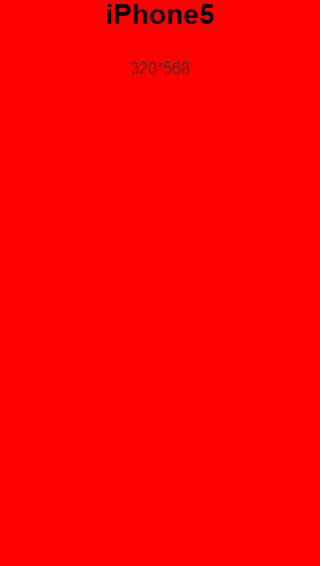

## 移动端页面尺寸

> 一个笨的方法，去统计计算市场上主流的用户买的多的手机的尺寸信息，然后根据尺寸信息来设计网页，偶尔有些小问题，用媒体查询，当然布局也很关键，奠定了基础。

&nbsp;&nbsp;**iPhone和iPad的故事:**
```
# 已经没有iPhone4了，谁会那么想不开用iPhone，淘汰了！，iPhone5勉勉强强可以

iPhone5: 320*568(Dpr:2) 
iPhone6: 375*667(Dpr:2)
iPhone6 Plus: 414*736(Dpr:3)
iPhone7: 375*667(Dpr:2)
iPhone7 Plus: 414*736(Dpr:3)
iPhoneX: 375*812(Dpr:3)
iPad Air 2: 768*1024(Dpr:2)
iPad Pro 10.5-inch: 834*1112(Dpr:2)
iPad Pro 12.9-inch: 1024*1366(Dpr:2) 
```
可能放楼下这个会有个直观点的视觉冲击，来吧，走你

<div style="width:320px; height:568px; background-color:red; margin:0 auto">
    <h2 style="text-align:center;">iPhone5</h2>
    <p style="text-align:center;">320*568</p>
</div>

意思一下好了，后面就不放了。。。。。。

后续: 坑爹啊，VSCode用div可以显示出来的在markdown里面，但是github就显示不出来，上次在颜色那节已经体验过了，哈哈哈，用vscode或者typora预览吧。

今天不小心打开上个星期写的这个，算了我还是截个图把。



&nbsp;&nbsp;**Google的Nexus:**
```
# Google的安卓标准

Nexus 5: 360*640(Dpr:3)
Nexus 5x: 411*731(Dpr:2.625)
Nexus 6: 412*732(Dpr:3.5)
```


&nbsp;&nbsp;**问题思考:**
```
# 今天无聊研究Android的图标的时候，我就在思考一个问题，为啥图标它基本上是png,基本上我们看到的那些图标，大众的尺寸是多少呢？记得在网页里和C#编程的时候，有一种ico的文件，那个图标翻译过来不是更符合逻辑？

我想是用png它不是透明的吗，就可以区别于jpg家族的不透明引起背景色的显示问题，然后谁想不开拿个gif乱晃在图标上，还不被用户喷，。所以png胜出。

尺寸的话，我是观察Android studio的midmap系列分析的，在它的文件夹下有两张，一张是圆的，一张是方的,这里是它安装好后的图标大小的那个。

    mipmap-hdpi：
        circle：72*72
        square: 72*72
    mipmap-mdpi：
        circle: 48*48
        square: 48*48
    好了，后面不用看了，同个文件夹下的图片的大小应该是一样的，它这个应该是跟不同尺寸的手机有关。
    mipmap-xhdpi：96*96
    mipmap-xxhdpi：144*144
    mipmap-xxxhdpi： 192*192

```

